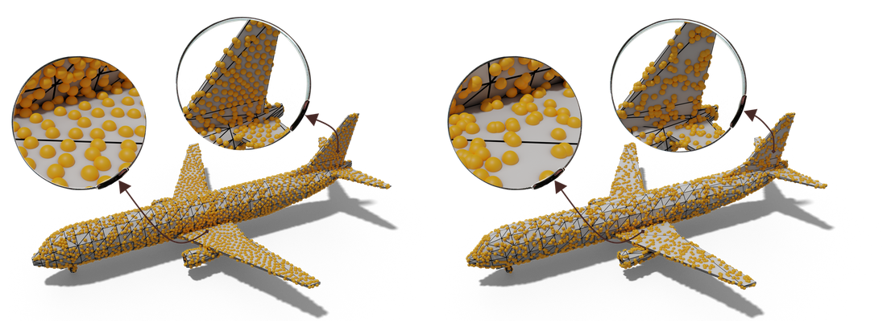

# MongeNet



This repository contains the official implementation of the paper ***"MongeNet: Efficient sampler for geometric deep learning"*** published in the Conference on Computer Vision and Pattern Recognition (CVPR21).

If you find our code or paper useful, please cite
```
@InProceedings{Lebrat:CVPR21:MongeNet,
    author    = {Lebrat, Leo and Santa Cruz, Rodrigo and Fookes, Clinton and Salvado, Olivier},
    title     = {MongeNet: Efficient sampler for geometric deep learning},
    booktitle = {Proceedings of the IEEE Conference on Computer Vision and Pattern Recognition (CVPR)},
    month     = {June},
    year      = {2021}
}
```

For further information or questions, please email leo.lebrat@csiro.au or rodrigo.santacruz@csiro.au.
See below detailed usage instructions:


## Installation

This software was developed using a High Computing Platform with SUSE Linux Enterprise 12, Nvidia P100 GPUs, python 3.7.2, CUDA 10.1.168, CUDNN v7.6.4, and Virtualenv to manage python dependencies. The installation is as follows,

1. Create a python environment:
```
virtualenv --python=python3.7 ./mongenet_venv/
source ./mongenet_venv/bin/activate
```

2. Install python libraries using PIP (you can also check the requirement files generated in ./requirements.txt):
```
pip install torch==1.7.0+cu101 torchvision==0.8.1+cu101 torchaudio==0.7.0 -f https://download.pytorch.org/whl/torch_stable.html
pip install hydra-core --upgrade
pip install trimesh 
pip install matplotlib
pip install tensorboard
```

3. Install [GeomLoss library](https://www.kernel-operations.io/geomloss/index.html) and its dependencies from the official git repo see this [link](https://www.kernel-operations.io/geomloss/api/install.html) for the detailed instructions.


## Usage

This repository is composed of python scripts parametrized by [Hydra configuration files](https://hydra.cc/docs/intro/). The main scripts are in the root directory while the default configuration files for these scripts are in ./configs/ folder.  **Our default configuration files are densely commented explaining in detail each one of the script's parameters.** These parameters can be overwritten from command line or providing an external configuration file.

### Data
MongeNet is trained over a dataset of 2D triangles and their respective optimal transport based point cloud approximations [using semi-discrete optimal transport](https://github.com/lebrat/semiDiscreteCurvling). To facilitate the use of this code base, this training data is available at [CSIRO-DAP](https://doi.org/10.25919/xfc9-1x76).

### Training MongeNet
MongeNet can be trained as follows,
```
python train.py trainer.output_dir=<OUT_DIR> user_config=<CONFIG_PATH>
```
where <OUT_DIR> is the path to the directory where snapshots and logs will be generated, while <CONFIG_PATH> is the path to a .yaml configuration file overwriting the default train configurations at ./configs/train.yaml.

### Sampling meshes with MongeNet
Once MongeNet is trained, one can sample point clouds from a batch of meshes by doing,
```
 python sample.py sampler.input_meshes=['<INPUT_MESH1>', '<INPUT_MESH2>', ...] sampler.output_dir=<OUTPUT_DIR> sampler.output_file_suffix=<OUTPUT_SUFIX> sampler.num_sampled_points=<NUM_POINTS>
```
where <INPUT_MESH1> and <INPUT_MESH2> are the input meshes, <OUTPUT_DIR> is the output directory where the generated point clouds will be saved with the filename <INPUT_MESH>_<OUTPUT_SUFIX>.ply, and <NUM_POINTS> is the number of points sampled from them. Note that these configurations can also be provided using a user-defined .yaml configuration file as before. See ./configs/sample.yaml for more information about the additional parameters provided.


### Acknowledgment 
This research was supported by [Maxwell plus](https://maxwellplus.com/)


